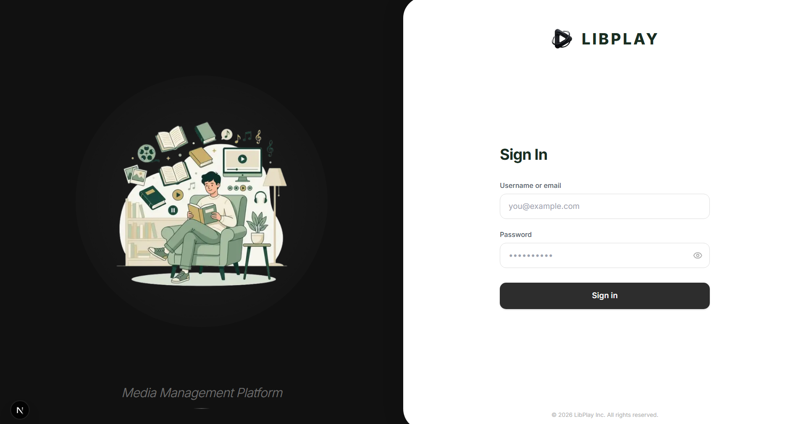
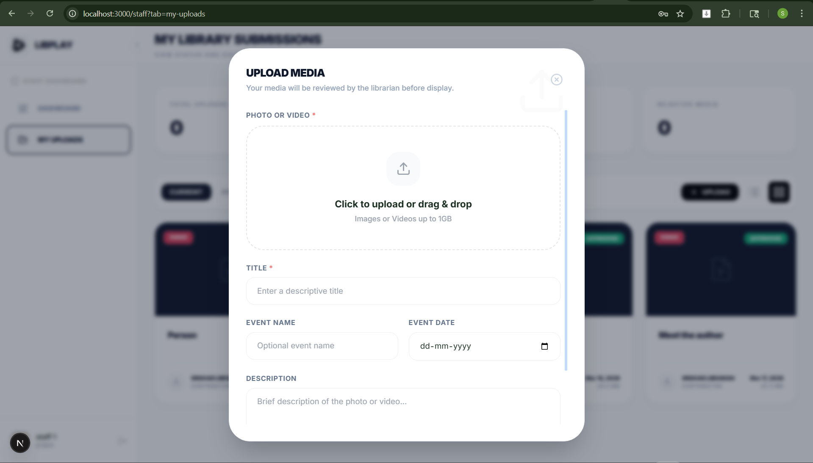
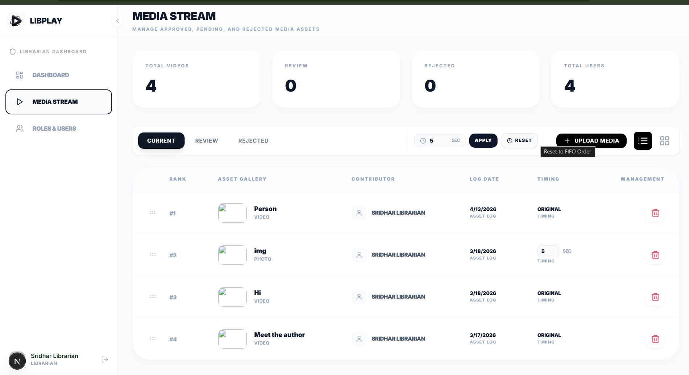
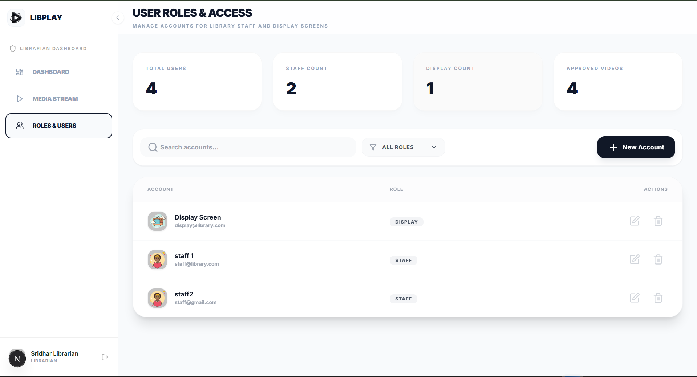

# LibPlay

LibPlay was built to solve a real campus challenge at the Sona College of Technology Central Library: sharing event photos and videos on Smart TVs in a consistent, reliable, and easy-to-manage way.

What began as a simple need became a complete digital media workflow. Staff can upload moments from library events, librarians can review and curate content, and approved media is automatically presented through a beautiful fullscreen display experience.

LibPlay is a role-based media platform designed for speed, control, and clarity, from upload to approval to public display.

## Live link
[Link](https://resedaceous-jeanelle-simply.ngrok-free.dev)
    **⚠️ IMPORTANT:** This Link only works when the server is on
    
## Screenshots

```markdown




```

## Highlights

- Role-based flows for `DISPLAY`, `STAFF`, `LIBRARIAN`, and `ADMIN`
- JWT cookie authentication
- Media upload, review, approval/rejection, reordering, and cleanup APIs
- Fullscreen display carousel for approved media
- Drag-and-drop ordering for media management
- MongoDB-backed storage for users and media metadata

## Tech Stack

- Next.js (App Router)
- React + TypeScript
- Tailwind CSS
- MongoDB (`mongodb` driver)
- JWT via `jose`

## Project Structure

```text
src/
  app/
    api/
      admin/seed/
      auth/
      media/
      users/
      storage/
    librarian/
    login/
    staff/
  components/
  context/
  lib/
storage/uploads/
```

## Prerequisites

- Node.js 20+ (recommended)
- npm
- MongoDB (local or Atlas)

## Environment Variables

Create a `.env.local` file in the project root:

```env
# MongoDB connection string. If omitted, defaults to mongodb://localhost:27017/libplay
DATABASE_URL=mongodb://localhost:27017/libplay

# Optional if DATABASE_URL contains <db_password>
DATABASE_PASSWORD=

# Optional database name (defaults to libplay)
DATABASE_NAME=libplay

# Required in production. A fallback exists in code for local dev.
JWT_SECRET=replace-with-a-strong-random-secret
```

## Getting Started

1. Install dependencies:

```bash
npm install
```

2. Start the development server:

```bash
npm run dev
```

3. Open the app:

- http://localhost:3000

## Seed Default Users

Seed users through the admin seed route:

```bash
curl http://localhost:3000/api/admin/seed
```

Default seeded accounts:

- `display@library.com` / `password123` (`DISPLAY`)
- `staff@library.com` / `password123` (`STAFF`)
- `librarian@library.com` / `password123` (`LIBRARIAN`)

## NPM Scripts

- `npm run dev` - Start dev server
- `npm run dev:80` - Start dev server on port 80
- `npm run build` - Production build
- `npm run start` - Start production server
- `npm run start:80` - Start production server on port 80
- `npm run lint` - Run linting
- `npm run db:seed` - Calls seed endpoint (verify route if customized)

## Role Routing

- `/` - Display carousel (requires login)
- `/staff` - Staff dashboard and uploads
- `/librarian` - Librarian dashboard and administration
- `/login` - Sign in

## API Overview

- Auth: `/api/auth/login`, `/api/auth/logout`, `/api/auth/me`, `/api/auth/profile`
- Media: `/api/media` and related subroutes (`upload`, `pending`, `stats`, `reorder`, `bulk-update`, `stream`, etc.)
- Users: `/api/users`, `/api/users/[id]`
- Admin seed: `/api/admin/seed`

## Storage

The repository includes `storage/uploads/` for upload-related files. Ensure this path is writable in your runtime environment.

## Notes

- `JWT_SECRET` should be set to a strong secret in production.
- Restrict production MongoDB access by IP/network and credentials.
- Review CORS/origin and proxy behavior before internet-facing deployment.
